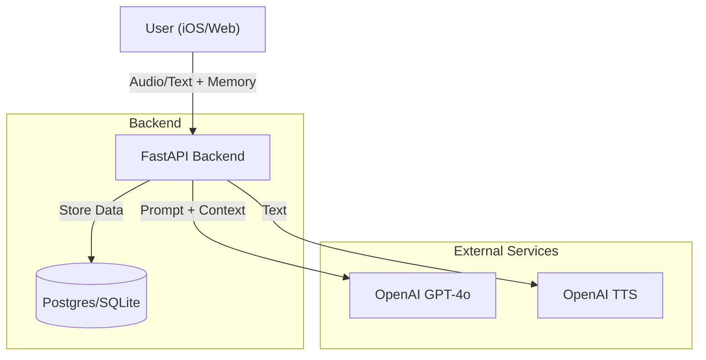

# Genau Tapi! 🐶🇩🇪
> *Your Chill German Conversational Companion*

**Genau Tapi!** is an AI-powered language coach designed to help you speak German naturally. Unlike strict grammar teachers, Tapi acts like a "chill friend"—prioritizing conversation flow and only correcting you when it really matters.

The core experience is built for **iOS**, providing a native, fluid voice interface. A web version is available for demonstration.

---

## 🌟 Key Features

### 🧠 **Distributed "Long-Term" Memory**
- **Context Awareness**: Tapi remembers your name, hobbies, and past topics even if you restart the app or the server wipes.
- **Client-Side Persistence**: To save tokens and ensure privacy, the "Memory Context" is stored on your device (iOS UserDefaults) and synced with the AI during conversation.

### 🗣️ **Natural Voice Interaction**
- **"Chill Friend" Persona**: The AI ignores minor mistakes (Grammar Score > 60) to keep the conversation flowing. It only interrupts with corrections if you make significant errors.
- **High-Quality TTS**: Uses OpenAI's `nova` voice for a warm, natural German accent.
- **Robust Audio Streaming**: Audio is streamed as Base64 data, ensuring instant playback without relying on temporary server files (Cloud-Native design).

### 📊 **Smart Scoring & Analytics**
- **Real-time Feedback**: Get instant scores on **Grammar** and **Style** (Naturalness).
- **Streak Tracking**: Keeps you motivated with a daily streak counter.
- **Leaderboard**: Compete globally with other users (tracked via IP and persistent streak sync).

---

## 🏗️ Architecture



## 🛠️ Technical Stack

- **Backend**: Python (FastAPI)
  - `openai` (GPT-4o-mini + TTS-1)
  - `sqlalchemy` + `alembic` (Database & Migrations)
  - `pydantic` for data validation
- **Database**: PostgreSQL (Production), SQLite (Dev)
- **Frontend (iOS)**: Swift (SwiftUI)
- **Frontend (Web)**: HTML/JS (Vanilla)
- **Infrastructure**: Docker, Docker Compose, GitHub Actions (CI)
- **Deployment**: Render

## 🚀 Getting Started

### Prerequisites
- Docker & Docker Compose
- OpenAI API Key

### Running Locally (Docker)
1. Clone the repository:
   ```bash
   git clone https://github.com/ecomunick/GenauTapi.git
   cd GenauTapi
   ```
2. Create `.env` file in root or `backend/`:
   ```bash
   OPENAI_API_KEY=your_key_here
   ```
3. Run with Docker Compose:
   ```bash
   docker-compose up --build
   ```
4. Access:
   - Web UI: http://localhost:8000
   - API Docs: http://localhost:8000/docs

### Running Tests
Backend integration tests are included using `pytest`.
```bash
cd backend
pip install -r requirements.txt
pytest tests/
```

## 🤖 AI Development (Agents)
This project utilizes AI Agents for development acceleration.
- **Antigravity (Google DeepMind)**: Used for planning, code generation (backend/frontend), and infrastructure setup.
- **MCP (Model Context Protocol)**: Enables the agent to interact with the filesystem, run commands, and manage GitHub directly.

See [AGENTS.md](AGENTS.md) for detailed workflow.

---

## 🌐 Web Demo
A web-based "Walkie-Talkie" version is available for testing and demonstration.
- **URL**: [https://genautapi.onrender.com/](https://genautapi.onrender.com/)

---

*Made with 🥨 and 🍺 by ecomunick*
