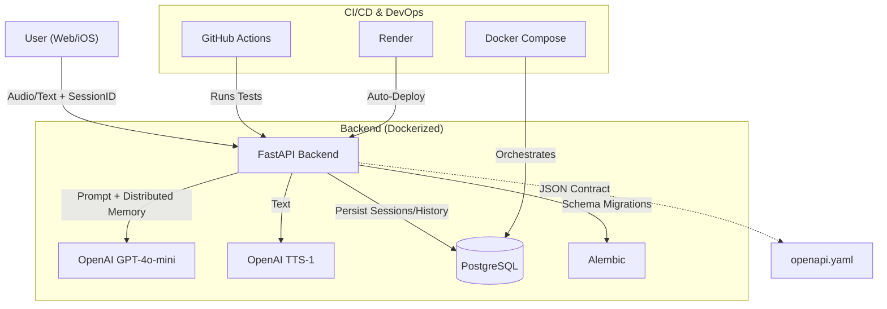

# Genau Tapi! 🐶🇩🇪
> *Your AI-Powered German Language Coach*

**Genau Tapi!** is a sophisticated German language assistant designed to help learners improve their speaking and grammar through natural, "chill" conversation. Built for the **DataTalksClub AI Dev Tools Zoomcamp**, this project demonstrates a modern full-stack AI application with persistent memory, voice interaction, and robust infrastructure.

---

## 🏗️ Architecture



---

## 🌟 Key Features

### 🧠 **Smart Memory System**
- **Distributed Context**: Tapi maintains a "Memory Context" (summarized history) that persists across sessions. 
- **Database Persistence**: User sessions and full chat histories are stored in **PostgreSQL**, indexed by a unique `session_id`.
- **Context-Aware Responses**: The AI uses past interactions to personalize greetings and topics.

### 🎙️ **Natural Voice Interaction & "Chill Mode"**
- **Walkie-Talkie Interface**: High-performance "Push-to-Talk" (Pointer Capture) web interface.
- **Natural Voice**: Uses OpenAI's `tts-1` model (`nova` voice) streamed via Base64 for zero-latency feel.
- **Friend Persona**: Prioritizes conversation flow over annoying corrections. It only provides grammar tips if the error is significant.

### 📝 **OpenAPI First Design**
- **Strict Contract**: The API is defined by an explicit `openapi.yaml` file, ensuring consistency between the backend implementation and any client (iOS/Web).
- **Auto-generated Docs**: Available at `/docs` (Swagger UI).

---

## 🛠️ Technical Stack

- **Backend**: Python 3.12 (FastAPI)
  - `openai`: GPT-4o-mini for logic, TTS-1 for voice.
  - `SQLAlchemy`: ORM for database management.
  - `Alembic`: Database versioning and migrations.
  - `pytest` + `httpx`: Comprehensive integration testing.
- **Database**: PostgreSQL (Cloud/Docker), SQLite (Testing).
- **Infrastructure**:
  - **Docker**: Containerized deployment for portability.
  - **CI/CD**: GitHub Actions for automated regression testing on every push.
  - **Hosting**: Render (Web Service + Managed Postgres).
- **Frontend**: Vanilla HTML5/JS with modern CSS (Glassmorphism & Pointer Events).

---

## 🚀 Setup & Reproducibility

### Prerequisites
- Docker & Docker Compose
- OpenAI API Key

### Running Locally (Docker)
1. Clone the repository:
   ```bash
   git clone https://github.com/ecomunick/GenauTapi.git
   cd GenauTapi
   ```
2. Create a `.env` file in the root directory:
   ```bash
   OPENAI_API_KEY=sk-...
   DATABASE_URL=postgresql://user:pass@db:5432/genautapi
   ```
3. Boot the entire stack:
   ```bash
   docker-compose up --build
   ```
   *The system will automatically run database migrations and start the server at `http://localhost:8000`.*

### Running Tests
Verified integration tests ensure the API and Database layer work correctly:
```bash
# Inside the container or locally
pytest backend/tests/
```

---

## 🔄 CI/CD Pipeline
- **Automated Testing**: On every `push` or `pull_request` to `main`, GitHub Actions spins up a test environment, initializes a test database, and runs the Pytest suite.
- **Deployment**: Successful merges to `main` trigger an automatic build and deploy to **Render**.

---

## 🤖 AI Agent Integration
This project was developed and refined using advanced AI Agent workflows:
- **Agent**: [Antigravity](https://github.com/google-deepmind) (Google DeepMind).
- **Tools**: Model Context Protocol (MCP) for filesystem and git management.
- **Workflow**: Automated audit, OpenAPI extraction, migration generation, and multi-round bug fixing.

See [**AGENTS.md**](AGENTS.md) for the full agent trajectory and role definitions.

---

## 🌐 Live Demo
Visit the live application: [**https://genautapi.onrender.com/**](https://genautapi.onrender.com/)

---

*Developed for the DataTalksClub AI Dev Tools Zoomcamp 🥨*
